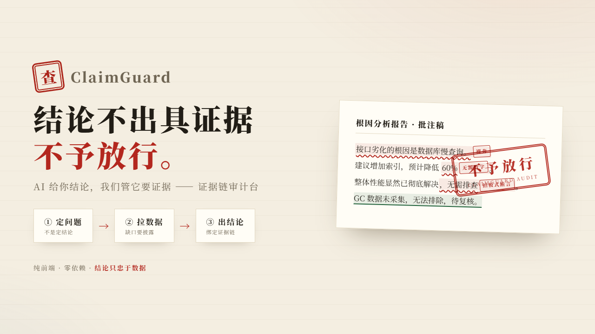
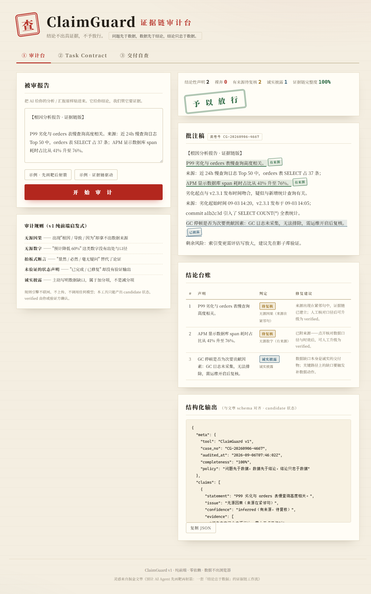

# ClaimGuard · 证据链审计台

<p align="center"></p>

> **结论不出具证据，不予放行。**
> 问题先于数据，数据先于结论，结论只忠于数据。

你让 AI 写一份"接口性能月报"，它 3 秒输出，结构漂亮、金句频出——但数据哪来的？口径对齐了吗？追两个问题就崩。这不是模型不够聪明，而是我们把"先想结论再找数据"这个人类职场的老毛病，原封不动交给了 Agent。

**ClaimGuard 把「结论忠于数据」的证据链工作流，做成了浏览器里的一键审计**：把 AI 生成的分析 / 汇报贴进来，揪出哪些结论在"裸奔"（无证据来源），输出带置信级别的结构化报告。

---

## ✦ 它能查什么

| 裸奔类型 | 典型特征 | 审计后果 |
|---|---|---|
| **无源因果** | "根因是慢查询""由于…导致…"，通篇没有数据来源 | 🔴 裸奔结论 |
| **无源数字** | "预计降低 60%""提升 30%"，数字没有出处与口径 | 🔴 裸奔结论 |
| **拍板式断言** | "显然""必然""毫无疑问""彻底解决"替代了论证 | 🔴 裸奔结论 |
| **未验证的状态声明** | "已完成 / 已修复"，却拿不出验证输出 | 🔴 裸奔结论 |
| **诚实披露** | "GC 日志未采集，无法排除"——数据缺口摆上台面 | 🔵 加分项 |

同时内置**证据回溯**：`结论。来源：xxx` 是标准证据链写法，来源句与结论句相邻时不会被分句误伤；附了来源的结论标记为 🟡 **有来源待复核**，人工核对口径后可升级为 verified。

## ✦ 功能一览

- **批注稿**——红笔波浪线 + "裸奔 / 有来源 / 已披露"印章徽标 + 案卷号，像审计员批公文
- **结论台账**——每条声明的判定与修复建议，按严重度排序
- **结构化输出**——与文章 schema 对齐的 JSON（`claims / disclosures / remaining_risks`），一键复制，candidate 状态交付
- **Task Contract 生成器**——intent / acceptance / forbidden / verify_commands 四件套，产出可直接抄进 Agent System Prompt 的"定问题合同"
- **Confidence Gate 自查**——交付前五问，全过才盖章"可交付"

## ✦ 快速开始

零依赖、零构建、数据不出浏览器：

```bash
# 方式一：直接打开
双击 index.html

# 方式二：本地起个静态服务
npx serve .
# 或
python -m http.server 8080
```

粘贴报告 → **Ctrl + Enter** → 看哪些结论在裸奔。试试内置的两个示例：先画靶后射箭（反例）vs 证据链驱动（正例）。

## ✦ 结构化输出示例

```json
{
  "meta": { "tool": "ClaimGuard v1", "completeness": "100%",
            "policy": "问题先于数据，数据先于结论，结论只忠于数据" },
  "claims": [
    { "statement": "P99 劣化与 orders 表慢查询高度相关。",
      "issue": "无源因果（来源在紧邻句）",
      "confidence": "inferred（有来源，待复核）",
      "evidence": ["报告内文已含来源标注，需人工点开核对"] }
  ],
  "disclosures": ["GC 日志未采集，无法排除，需运维开启后复核。"],
  "remaining_risks": ["补证据或降级置信：给因果链补上数据来源…"],
  "note": "本输出为 candidate 状态；verified 需由人工或独立验证方复核后标注。"
}
```

## ✦ 诚实声明（本工具自己的证据链）

- v1 为**纯前端启发式规则引擎**：不联网、不上传、不调用任何模型
- 规则引擎只能证明"没找到证据"，不能证明"证据为假"——所以它只产出 **candidate** 状态，`verified` 必须由你或独立验证方确认
- 这不是免责声明，这是方法论本身：**行动权、自评权、评分权、环境修改权四权分离**

## ✦ 界面

<p align="center"></p>
<p align="center"></p>

## ✦ 配套文章

《别让 AI Agent 先画靶再射箭：一套「结论忠于数据」的证据链工作流》（掘金 · 链接见作品页）

## License

MIT
